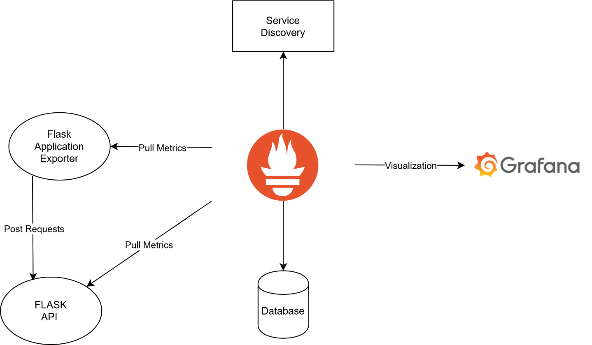
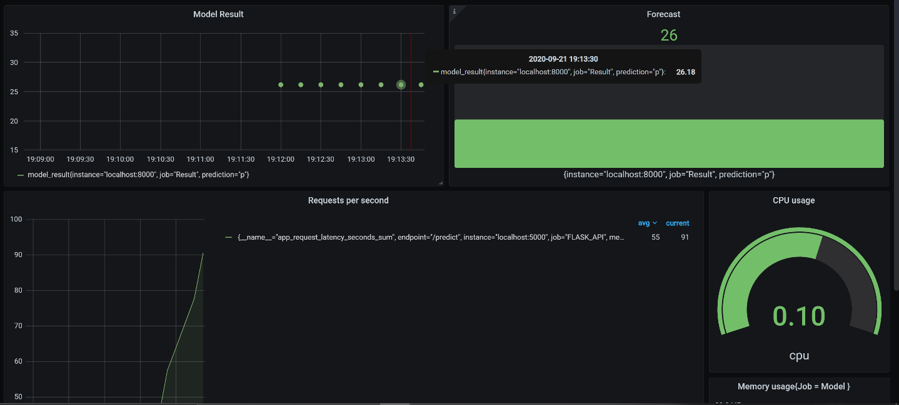
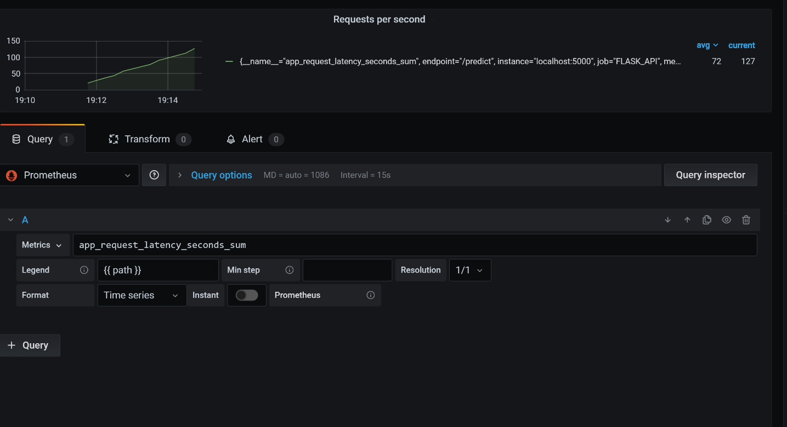

# Monitoring-ML-API
Monitoring and Alerting infrastructure for a Machine Learning API using Prometheus and Grafana

## Motivation 
This Project is a standalone of summer's internship , the goal was to support the Data Science team in the post-production of Machine Learning Algorithm, Monitoring it's performance and alerting whenever it reachs a certain treshhold of prediction.
I was assigned with desiging and developing of the API and the Prometheus-exporter.

## Build status
[](https://github.com/Mhaycen/Monitoring-ML-API/blob/master/webapp/app.py)

## Installation
Build Docker image and tag as ml-api

```
docker-compose -f docker-compose.yml -f docker-compose-infra.yml build
```


```
docker-compose -f docker-compose.yml -f docker-compose-infra.yml up -d 
```


* port `9090` will show the Prometheus graph.
* port `3000` will show the Grafana Dashboards.
* port `8000` will show the metrics in Raw format.
## Project's Architecture 


## WalkThrough 
The ML algortihm used is a toy model (Boston House Model prediction) for testing purposes. 
The model was loaded into the flask API using Pickle Library. It takes model python file and serialize it so it can be loaded afterwards in the flask API : 
```python
with open('model/models.pkl', 'rb') as f:
    classifier = pickle.load(f)

with open('model/model_columns.pkl', 'rb') as f:
    model_columns = pickle.load(f)
```
### Prometheus
Prometheus is a framework and time series database that takes metrics from applications and stores them into its database for later visualizations. The exporter takes from a .csv file data related to the model to serve as an input for the model, takes each row of the .csv and transforms it to a json so it can be sent as a Post request to the FLASK-API and registers it the response as a Gauge metric.
```python
class JsonCollector(object) :


    def collect(self):

        model_result_metric = GaugeMetricFamily('model_result', 'Model Result', labels = {'prediction'})
        df = pd.read_csv(r"/mnt/c/Users/heyas/Documents/MLAPI/webapp/data/newHousing.csv", delimiter = ',', na_values="nan")
        for row in df.itertuples():
            features = [{'CRIM' : row.CRIM, 'ZN' : row.ZN, 'INDUS' : row.INDUS, 'CHAS' : row.CHAS, 'NOX' : row.NOX, 'RM' : row.RM, 'AGE' : row.AGE, 'DIS' : row.DIS, 'RAD' : row.RAD, 'TAX' : row.TAX, 'PTRATIO' : row.PTRATIO, 'B' : row.B, 'LSTAT' : row.LSTAT}]
            postrequest = json.dumps(features)
            response  = requests.post(url = 'http://127.0.0.1:5000/predict' , json = postrequest)            
            prediction = response.json()
            model_result_metric.add_metric('prediction_value', value = prediction['prediction'][0]) 
            
            yield model_result_metric

dispatcher = DispatcherMiddleware(app.wsgi_app, {"/metrics": make_wsgi_app()})
```
### Metrics 

The metric is first defined and given a Label: 
```python
     model_result_metric = GaugeMetricFamily('model_result', 'Model Result', labels = {'prediction'})
```
Name | Type | Description
|  :---: | :---: | :---:
model_result_metric  | Gauge | Registres Model's result from The Post's requests responses
flask_http_request_duration_seconds | Histogram | Flask HTTP request duration in seconds for all Flask requests
flask_http_request_total | Counter | Total number of HTTP requests for all Flask requests.

## Visualization With Grafana 
After running Grafana we can setup dashboards using PromQL , Prometheus’s query language , to visualize a specific metric we only need to write its label name that we have set in the code before as a gauge :



